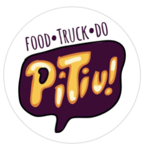

<html lang="pt-br">
<head>
  <meta charset="UTF-8">
  <meta name="viewport" content="width=device-width, initial-scale=1.0, maximum-scale=1.0, user-scalable=no">
  <title>Cardápio Completo - FoodTruck do Pitiu</title>
  <link rel="stylesheet" href="https://cdnjs.cloudflare.com/ajax/libs/font-awesome/6.0.0-beta3/css/all.min.css">
  
</head>
<body>
  

    
    <h1>𝙁𝙊𝙊𝘿𝙏𝙍𝙐𝘾𝙆 𝘿𝙊 𝙋𝙄𝙏𝙄𝙐</h1>
    
Fechado

    
📍 Praça Saiqui, Vila Valqueire

    
🛵 Cardápio impresso::Instagram::Whatsapp: é só clicar ⤵️

    

      <a href="https://www.canva.com/design/DAFiXrcSAYE/SyFYhg2E6JroZstX3cA_hA/view?website#4" target="_blank" title="Menuimpresso"><i class="fas fa-book-open"></i></a>
      <a href="https://www.instagram.com/foodtruckdopitiu/" target="_blank" title="Instagram"><i class="fab fa-instagram"></i></a>
      <a href="https://wa.me/5521992254487" target="_blank" title="WhatsApp"><i class="fab fa-whatsapp"></i></a>
    

  

  

    
Hambúrgueres

    
Pão de Queijo

    
Pastelzinho

    
Petiscos

    
Bebidas

    
Smoothie

    
Cervejas

  

  

    

      <!-- Hambúrgueres -->
      

        
Hambúrgueres Artesanais

        
        

          
          

            <h3 class="item-title">Carne no Prato - R$18</h3>
            
Blend da casa de 180g, queijo prato e mussarela no pão brioche.

            
R$ 18,00

            

              <button class="add-to-cart" onclick="openAddonsModal('Carne no Prato', 18, 'https://source.unsplash.com/random/300x300/?burger,1')">Adicionar</button>
            

          

        

        
        

          
          

            <h3 class="item-title">Cheeseburguer - R$22</h3>
            
Blend da casa de 180g, queijo prato, mussarela e maionese da casa no pão brioche.

            
R$ 22,00

            

              <button class="add-to-cart" onclick="openAddonsModal('Cheeseburguer', 22, 'https://source.unsplash.com/random/300x300/?burger,2')">Adicionar</button>
            

          

        

        
        

          
          

            <h3 class="item-title">Cheese Calabresa - R$23</h3>
            
Blend da casa de 180g, calabresa, queijo prato, mussarela e maionese da casa no pão brioche.

            
R$ 23,00

            

              <button class="add-to-cart" onclick="openAddonsModal('Cheese Calabresa', 23, 'https://source.unsplash.com/random/300x300/?burger,3')">Adicionar</button>
            

          

        

        
        

          
          

            <h3 class="item-title">Cheese Bacon - R$26</h3>
            
Blend da casa de 180g, bacon, queijo prato, mussarela e maionese da casa no pão brioche.

            
R$ 26,00

            

              <button class="add-to-cart" onclick="openAddonsModal('Cheese Bacon', 26, 'https://source.unsplash.com/random/300x300/?burger,4')">Adicionar</button>
            

          

        

        
        

          
          

            <h3 class="item-title">Kids - R$18</h3>
            
Blend da casa de 90g, queijo prato, mussarela no pão brioche.

            
R$ 18,00

            

              <button class="add-to-cart" onclick="openAddonsModal('Kids', 18, 'https://source.unsplash.com/random/300x300/?burger,5')">Adicionar</button>
            

          

        

        
        

          
          

            <h3 class="item-title">Black - R$32</h3>
            
Blend da casa de 180g, anéis de cebola, bacon, calabresa, queijo prato, mussarela, barbecue e maionese da casa no pão triplo X (brioche com bacon, calabresa e parmesão).

            
R$ 32,00

            

              <button class="add-to-cart" onclick="openAddonsModal('Black', 32, 'https://source.unsplash.com/random/300x300/?burger,6')">Adicionar</button>
            

          

        

        
        

          
          

            <h3 class="item-title">Cheddar Cremoso - R$32</h3>
            
Blend da casa de 180g, bacon, cebola caramelizada e cheddar cremoso no pão australiano.

            
R$ 32,00

            

              <button class="add-to-cart" onclick="openAddonsModal('Cheddar Cremoso', 32, 'https://source.unsplash.com/random/300x300/?burger,7')">Adicionar</button>
            

          

        

        
        

          
          

            <h3 class="item-title">Pitiuzinho - R$34</h3>
            
Blend da casa de 180g, bacon, cebola caramelizada, cheddar cremoso e catupiry no pão de queijo.

            
R$ 34,00

            

              <button class="add-to-cart" onclick="openAddonsModal('Pitiuzinho', 34, 'https://source.unsplash.com/random/300x300/?burger,8')">Adicionar</button>
            

          

        

      

      <!-- Pão de Queijo -->
      

        
Pão de Queijo Recheado

        
        

          
          

            <h3 class="item-title">Sem Recheio - R$9</h3>
            
Pão de queijo tradicional sem recheio.

            
R$ 9,00

            

              <button class="add-to-cart" onclick="addItem('Pão de Queijo Sem Recheio', 9, 'https://source.unsplash.com/random/300x300/?cheese-bread,1')">Adicionar</button>
            

          

        

        
        

          
          

            <h3 class="item-title">Frango com Catupiry - R$18</h3>
            
Frango desfiado com catupiry cremoso.

            
R$ 18,00

            

              <button class="add-to-cart" onclick="addItem('Pão de Queijo Frango Catupiry', 18, 'https://source.unsplash.com/random/300x300/?cheese-bread,2')">Adicionar</button>
            

          

        

        
        

          
          

            <h3 class="item-title">Cheddar (com ou sem cebola) - R$17</h3>
            
Recheio de cheddar derretido com opção de cebola.

            
R$ 17,00

            

              <button class="add-to-cart" onclick="addItem('Pão de Queijo Cheddar', 17, 'https://source.unsplash.com/random/300x300/?cheese-bread,3')">Adicionar</button>
            

          

        

        
        

          
          

            <h3 class="item-title">Catupiry (com ou sem cebola) - R$17</h3>
            
Recheio de catupiry cremoso com opção de cebola.

            
R$ 17,00

            

              <button class="add-to-cart" onclick="addItem('Pão de Queijo Catupiry', 17, 'https://source.unsplash.com/random/300x300/?cheese-bread,4')">Adicionar</button>
            

          

        

        
        

          
          

            <h3 class="item-title">Chester Defumado com Catupiry - R$19</h3>
            
Carne de chester defumada com catupiry cremoso.

            
R$ 19,00

            

              <button class="add-to-cart" onclick="addItem('Pão de Queijo Chester Catupiry', 19, 'https://source.unsplash.com/random/300x300/?cheese-bread,5')">Adicionar</button>
            

          

        

        
        

          
          

            <h3 class="item-title">Carne Seca com Catupiry - R$20</h3>
            
Carne seca desfiada com catupiry cremoso.

            
R$ 20,00

            

              <button class="add-to-cart" onclick="addItem('Pão de Queijo Carne Seca Catupiry', 20, 'https://source.unsplash.com/random/300x300/?cheese-bread,6')">Adicionar</button>
            

          

        

        
        

          
          

            <h3 class="item-title">Camarão com Catupiry - R$23</h3>
            
Camarão ao molho com catupiry cremoso.

            
R$ 23,00

            

              <button class="add-to-cart" onclick="addItem('Pão de Queijo Camarão Catupiry', 23, 'https://source.unsplash.com/random/300x300/?cheese-bread,7')">Adicionar</button>
            

          

        

        
        <!-- Adicionando a parte Doce -->
        

          
          

            <h3 class="item-title">Doce de Leite - R$14</h3>
            
Pão de queijo recheado com doce de leite cremoso.

            
R$ 14,00

            

              <button class="add-to-cart" onclick="addItem('Pão de Queijo Doce de Leite', 14, 'https://source.unsplash.com/random/300x300/?cheese-bread,8')">Adicionar</button>
            

          

        

        
        

          
          

            <h3 class="item-title">Romeu e Julieta - R$15</h3>
            
Pão de queijo recheado com queijo e goiabada.

            
R$ 15,00

            

              <button class="add-to-cart" onclick="addItem('Pão de Queijo Romeu e Julieta', 15, 'https://source.unsplash.com/random/300x300/?cheese-bread,9')">Adicionar</button>
            

          

        

        
        

          
          

            <h3 class="item-title">Chocolate Preto - R$16</h3>
            
Pão de queijo recheado com chocolate preto.

            
R$ 16,00

            

              <button class="add-to-cart" onclick="addItem('Pão de Queijo Chocolate Preto', 16, 'https://source.unsplash.com/random/300x300/?cheese-bread,10')">Adicionar</button>
            

          

        

        
        

          
          

            <h3 class="item-title">Chocolate Branco - R$16</h3>
            
Pão de queijo recheado com chocolate branco.

            
R$ 16,00

            

              <button class="add-to-cart" onclick="addItem('Pão de Queijo Chocolate Branco', 16, 'https://source.unsplash.com/random/300x300/?cheese-bread,11')">Adicionar</button>
            

          

        

        
        

          
          

            <h3 class="item-title">Chocolate Misto - R$16</h3>
            
Pão de queijo recheado com chocolate preto e branco.

            
R$ 16,00

            

              <button class="add-to-cart" onclick="addItem('Pão de Queijo Chocolate Misto', 16, 'https://source.unsplash.com/random/300x300/?cheese-bread,12')">Adicionar</button>
            

          

        

        
        

          
          

            <h3 class="item-title">Nutella (com ou sem morango) - R$20</h3>
            
Pão de queijo recheado com Nutella e opção de morango.

            
R$ 20,00

            

              <button class="add-to-cart" onclick="addItem('Pão de Queijo Nutella', 20, 'https://source.unsplash.com/random/300x300/?cheese-bread,13')">Adicionar</button>
            

          

        

      

      <!-- Pastelzinho -->
      

        
Pastelzinho

        
        

          
          

            <h3 class="item-title">Queijo - R$6</h3>
            
Pastelzinho recheado com queijo derretido.

            
R$ 6,00

            

              <button class="add-to-cart" onclick="addItem('Pastelzinho Queijo', 6, 'https://source.unsplash.com/random/300x300/?pastry,1')">Adicionar</button>
            

          

        

        
        

          
          

            <h3 class="item-title">Cheddar (com ou sem cebola) - R$6</h3>
            
Pastelzinho recheado com cheddar derretido e opção de cebola.

            
R$ 6,00

            

              <button class="add-to-cart" onclick="addItem('Pastelzinho Cheddar', 6, 'https://source.unsplash.com/random/300x300/?pastry,2')">Adicionar</button>
            

          

        

        
        

          
          

            <h3 class="item-title">Catupiry (com ou sem cebola) - R$6</h3>
            
Pastelzinho recheado com catupiry cremoso e opção de cebola.

            
R$ 6,00

            

              <button class="add-to-cart" onclick="addItem('Pastelzinho Catupiry', 6, 'https://source.unsplash.com/random/300x300/?pastry,3')">Adicionar</button>
            

          

        

        
        

          
          

            <h3 class="item-title">Carne Moída - R$7</h3>
            
Pastelzinho recheado com carne moída temperada.

            
R$ 7,00

            

              <button class="add-to-cart" onclick="addItem('Pastelzinho Carne Moída', 7, 'https://source.unsplash.com/random/300x300/?pastry,4')">Adicionar</button>
            

          

        

        
        

          
          

            <h3 class="item-title">Carne Seca - R$7</h3>
            
Pastelzinho recheado com carne seca desfiada.

            
R$ 7,00

            

              <button class="add-to-cart" onclick="addItem('Pastelzinho Carne Seca', 7, 'https://source.unsplash.com/random/300x300/?pastry,5')">Adicionar</button>
            

          

        

        
        

          
          

            <h3 class="item-title">Camarão - R$9</h3>
            
Pastelzinho recheado com camarão ao molho.

            
R$ 9,00

            

              <button class="add-to-cart" onclick="addItem('Pastelzinho Camarão', 9, 'https://source.unsplash.com/random/300x300/?pastry,6')">Adicionar</button>
            

          

        

        
        

          
          

            <h3 class="item-title">Aplicação de Catupiry - R$2</h3>
            
Adicione catupiry cremoso ao seu pastelzinho.

            
R$ 2,00

            

              <button class="add-to-cart" onclick="addItem('Aplicação de Catupiry', 2, 'https://source.unsplash.com/random/300x300/?pastry,7')">Adicionar</button>
            

          

        

        
        <!-- Adicionando a parte Doce -->
        

          
          

            <h3 class="item-title">Doce de Leite - R$6</h3>
            
Pastelzinho recheado com doce de leite cremoso.

            
R$ 6,00

            

              <button class="add-to-cart" onclick="addItem('Pastelzinho Doce de Leite', 6, 'https://source.unsplash.com/random/300x300/?pastry,8')">Adicionar</button>
            

          

        

        
        

          
          

            <h3 class="item-title">Romeu e Julieta - R$6</h3>
            
Pastelzinho recheado com queijo e goiabada.

            
R$ 6,00

            

              <button class="add-to-cart" onclick="addItem('Pastelzinho Romeu e Julieta', 6, 'https://source.unsplash.com/random/300x300/?pastry,9')">Adicionar</button>
            

          

        

        
        

          
          

            <h3 class="item-title">Chocolate Preto - R$6</h3>
            
Pastelzinho recheado com chocolate preto.

            
R$ 6,00

            

              <button class="add-to-cart" onclick="addItem('Pastelzinho Chocolate Preto', 6, 'https://source.unsplash.com/random/300x300/?pastry,10')">Adicionar</button>
            

          

        

        
        

          
          

            <h3 class="item-title">Chocolate Branco - R$6</h3>
            
Pastelzinho recheado com chocolate branco.

            
R$ 6,00

            

              <button class="add-to-cart" onclick="addItem('Pastelzinho Chocolate Branco', 6, 'https://source.unsplash.com/random/300x300/?pastry,11')">Adicionar</button>
            

          

        

        
        

          
          

            <h3 class="item-title">Chocolate Misto - R$6</h3>
            
Pastelzinho recheado com chocolate preto e branco.

            
R$ 6,00

            

              <button class="add-to-cart" onclick="addItem('Pastelzinho Chocolate Misto', 6, 'https://source.unsplash.com/random/300x300/?pastry,12')">Adicionar</button>
            

          

        

        
        

          
          

            <h3 class="item-title">Nutella - R$7</h3>
            
Pastelzinho recheado com Nutella.

            
R$ 7,00

            

              <button class="add-to-cart" onclick="addItem('Pastelzinho Nutella', 7, 'https://source.unsplash.com/random/300x300/?pastry,13')">Adicionar</button>
            

          

        

      

      <!-- Petiscos -->
      

        
Petiscos

        
        

          
          

            <h3 class="item-title">Batata Canoa 200G - R$14</h3>
            
Batata canoa crocante (acompanha maionese da casa).

            
R$ 14,00

            

              <button class="add-to-cart" onclick="addItem('Batata Canoa 200G', 14, 'https://source.unsplash.com/random/300x300/?snack,1')">Adicionar</button>
            

          

        

        
        

          
          

            <h3 class="item-title">Anéis de Cebola 10 Und. - R$14</h3>
            
Anéis de cebola empanados (acompanha maionese da casa).

            
R$ 14,00

            

              <button class="add-to-cart" onclick="addItem('Anéis de Cebola 10 Und.', 14, 'https://source.unsplash.com/random/300x300/?snack,2')">Adicionar</button>
            

          

        

        
        

          
          

            <h3 class="item-title">Batata Canoa 200g - R$25</h3>
            
Batata canoa com cheddar ou catupiry e bacon.

            
R$ 25,00

            

              <button class="add-to-cart" onclick="addItem('Batata Canoa Especial', 25, 'https://source.unsplash.com/random/300x300/?snack,3')">Adicionar</button>
            

          

        

        
        

          
          

            <h3 class="item-title">Provolone à Milanesa - R$30</h3>
            
Provolone empanado (acompanha maionese da casa).

            
R$ 30,00

            

              <button class="add-to-cart" onclick="addItem('Provolone à Milanesa', 30, 'https://source.unsplash.com/random/300x300/?snack,4')">Adicionar</button>
            

          

        

      

      <!-- Bebidas -->
      

        
Bebidas

        
        

          
          

            <h3 class="item-title">Água - R$4</h3>
            
Água mineral sem gás 500ml.

            
R$ 4,00

            

              <button class="add-to-cart" onclick="addItem('Água', 4, 'https://source.unsplash.com/random/300x300/?water,1')">Adicionar</button>
            

          

        

        
        

          
          

            <h3 class="item-title">Água com gás - R$5</h3>
            
Água mineral com gás 500ml.

            
R$ 5,00

            

              <button class="add-to-cart" onclick="addItem('Água com gás', 5, 'https://source.unsplash.com/random/300x300/?sparkling-water,1')">Adicionar</button>
            

          

        

        
        

          
          

            <h3 class="item-title">Guaravita - R$4</h3>
            
Refrigerante Guaravita 290ml.

            
R$ 4,00

            

              <button class="add-to-cart" onclick="addItem('Guaravita', 4, 'https://source.unsplash.com/random/300x300/?guarana,1')">Adicionar</button>
            

          

        

        
        

          
          

            <h3 class="item-title">Guaraviton - R$6</h3>
            
Refrigerante Guaraviton 290ml.

            
R$ 6,00

            

              <button class="add-to-cart" onclick="addItem('Guaraviton', 6, 'https://source.unsplash.com/random/300x300/?guarana,2')">Adicionar</button>
            

          

        

        
        

          
          

            <h3 class="item-title">Mate (Natural ou Limão) - R$6</h3>
            
Refrigerante Mate 290ml.

            
R$ 6,00

            

              <button class="add-to-cart" onclick="addItem('Mate', 6, 'https://source.unsplash.com/random/300x300/?mate,1')">Adicionar</button>
            

          

        

        
        

          
          

            <h3 class="item-title">Ice Tea (Pêssego ou Limão) - R$6</h3>
            
Ice Tea 290ml.

            
R$ 6,00

            

              <button class="add-to-cart" onclick="addItem('Ice Tea', 6, 'https://source.unsplash.com/random/300x300/?ice-tea,1')">Adicionar</button>
            

          

        

        
        

          
          

            <h3 class="item-title">Refrigerante Lata - R$6</h3>
            
Coca-cola, Coca-cola Zero, Pepsi, Guaraná, Guaraná Zero, Sprite, Fanta Laranja, Fanta Uva, Citrus ou Água Tônica.

            
R$ 6,00

            

              <button class="add-to-cart" onclick="addItem('Refrigerante Lata', 6, 'https://source.unsplash.com/random/300x300/?soda,1')">Adicionar</button>
            

          

        

        
        

          
          

            <h3 class="item-title">H2O (Limão ou Limoneto) - R$7</h3>
            
H2O 500ml.

            
R$ 7,00

            

              <button class="add-to-cart" onclick="addItem('H2O', 7, 'https://source.unsplash.com/random/300x300/?h2o,1')">Adicionar</button>
            

          

        

        
        

          
          

            <h3 class="item-title">Refrigerante 600ml - R$9</h3>
            
Coca-cola ou Coca-cola Zero 600ml.

            
R$ 9,00

            

              <button class="add-to-cart" onclick="addItem('Refrigerante 600ml', 9, 'https://source.unsplash.com/random/300x300/?soda,2')">Adicionar</button>
            

          

        

        
        

          
          

            <h3 class="item-title">Suco de Laranja Natural - R$10 (300ml) / R$25 (1L)</h3>
            
Suco de laranja natural fresco.

            
R$ 10,00 / R$ 25,00

            

              <button class="add-to-cart" onclick="addItem('Suco Laranja 300ml', 10, 'https://source.unsplash.com/random/300x300/?orange-juice,1')">300ml</button>
              <button class="add-to-cart" onclick="addItem('Suco Laranja 1L', 25, 'https://source.unsplash.com/random/300x300/?orange-juice,1')">1 Litro</button>
            

          

        

        
        

          
          

            <h3 class="item-title">Coco Gelado - R$8</h3>
            
Água de coco natural gelada.

            
R$ 8,00

            

              <button class="add-to-cart" onclick="addItem('Coco Gelado', 8, 'https://source.unsplash.com/random/300x300/?coconut,1')">Adicionar</button>
            

          

        

      

      <!-- Smoothie -->
      

        
Smoothie

        
        

          
          

            <h3 class="item-title">Morango 500ml - R$18</h3>
            
Bebida cremosa de morango.

            
R$ 18,00

            

              <button class="add-to-cart" onclick="addItem('Smoothie Morango', 18, 'https://source.unsplash.com/random/300x300/?smoothie,1')">Adicionar</button>
            

          

        

      

      <!-- Cervejas -->
      

        
Cervejas

        
        

          
          

            <h3 class="item-title">Stella, Budweiser ou Eisenbahn Longneck - R$9</h3>
            
Cerveja longneck 355ml.

            
R$ 9,00

            

              <button class="add-to-cart" onclick="addItem('Cerveja Longneck Stella/Budweiser/Eisenbahn', 9, 'https://source.unsplash.com/random/300x300/?beer,1')">Adicionar</button>
            

          

        

        
        

          
          

            <h3 class="item-title">Heineken, Heineken Zero ou Corona Longneck - R$10</h3>
            
Cerveja longneck 355ml.

            
R$ 10,00

            

              <button class="add-to-cart" onclick="addItem('Cerveja Longneck Heineken/Corona', 10, 'https://source.unsplash.com/random/300x300/?beer,2')">Adicionar</button>
            

          

        

        
        

          
          

            <h3 class="item-title">Stella, Original, Spaten, Eisenbahn, Budweiser, Duplo Malte ou Serramalte 600ml - R$13</h3>
            
Cerveja 600ml.

            
R$ 13,00

            

              <button class="add-to-cart" onclick="addItem('Cerveja 600ml Variadas', 13, 'https://source.unsplash.com/random/300x300/?beer,3')">Adicionar</button>
            

          

        

        
        

          
          

            <h3 class="item-title">Heineken 600ml - R$14</h3>
            
Cerveja Heineken 600ml.

            
R$ 14,00

            

              <button class="add-to-cart" onclick="addItem('Heineken 600ml', 14, 'https://source.unsplash.com/random/300x300/?beer,4')">Adicionar</button>
            

          

        

        
        

          
          

            <h3 class="item-title">Colorado 600ml - R$20</h3>
            
Cerveja artesanal Colorado 600ml.

            
R$ 20,00

            

              <button class="add-to-cart" onclick="addItem('Colorado 600ml', 20, 'https://source.unsplash.com/random/300x300/?beer,5')">Adicionar</button>
            

          

        

        
        

          
          

            <h3 class="item-title">Latão de Brahma ou Antarctica - R$8</h3>
            
Cerveja em lata 473ml.

            
R$ 8,00

            

              <button class="add-to-cart" onclick="addItem('Latão Brahma/Antarctica', 8, 'https://source.unsplash.com/random/300x300/?beer,6')">Adicionar</button>
            

          

        

      

    

    <!-- Carrinho de Compras -->
    

      <h2 class="cart-title">Seu Pedido</h2>
      

        
Seu carrinho está vazio

      

      
Total: R$ 0,00

      

        <button class="cart-button checkout-button" onclick="openCheckoutModal()">Finalizar Pedido</button>
        <button class="cart-button clear-button" onclick="clearCart()">Limpar Carrinho</button>
      

    

  

  <!-- Modal de Checkout -->
  

    

      &times;
      <h2>Finalizar Pedido</h2>
      
      <form id="checkout-form">
        

          <label for="customer-name">1. Seu nome / Celular:</label>
          <input type="text" id="customer-name" placeholder="Nome completo" required>
          <input type="tel" id="customer-phone" placeholder="Celular (com DDD)" required style="margin-top: 0.5rem;">
        

        
        

          <label>2. Pedido completo:</label>
          

            <!-- Itens do pedido serão inseridos aqui pelo JavaScript -->
          

        

        
        

          <label>3. Opção de retirada:</label>
          

            

              <input type="radio" id="option-retirada" name="delivery-option" value="retirada">
              <label for="option-retirada">Retirada</label>
            

            

              <input type="radio" id="option-local" name="delivery-option" value="local">
              <label for="option-local">Comer no Local</label>
            

            

              <input type="radio" id="option-entrega" name="delivery-option" value="entrega" checked>
              <label for="option-entrega">Entrega</label>
            

          

        

        
        

          <label for="customer-neighborhood">4. Bairro:</label>
          <select id="customer-neighborhood" required onchange="updateDeliveryFee()">
            <option value="">Selecione seu bairro</option>
            <option value="Cascadura">Cascadura (Taxa: R$12,00)</option>
            <option value="Madureira">Madureira (Taxa: R$10,00)</option>
            <option value="Vila Valqueire">Vila Valqueire (Taxa: R$5,00)</option>
            <option value="Marechal Hermes">Marechal Hermes (Taxa: R$8,00)</option>
            <option value="Bento Ribeiro">Bento Ribeiro (Taxa: R$10,00)</option>
            <option value="Campinho">Campinho (Taxa: R$10,00)</option>
            <option value="Oswaldo Cruz">Oswaldo Cruz (Taxa: R$8,00)</option>
            <option value="Praça Seca">Praça Seca (Taxa: R$15,00)</option>
            <option value="Tanque">Tanque (Taxa: R$15,00)</option>
          </select>
        

        
        

          <label for="customer-address">Endereço completo:</label>
          <input type="text" id="customer-street" placeholder="Rua" required>
          <input type="text" id="customer-number" placeholder="Número" required style="margin-top: 0.5rem;">
          <input type="text" id="customer-complement" placeholder="Complemento (apto/casa/local)" style="margin-top: 0.5rem;">
          <input type="text" id="customer-zipcode" placeholder="CEP" required style="margin-top: 0.5rem;">
        

        
        

          Taxa de entrega: R$ 0,00
        

        
        

          <label>5. Forma de pagamento:</label>
          

            

              <input type="radio" id="payment-pix" name="payment" value="PIX" checked>
              <label for="payment-pix">PIX</label>
            

            

              <input type="radio" id="payment-cash" name="payment" value="Dinheiro">
              <label for="payment-cash">Dinheiro</label>
            

            

              <input type="radio" id="payment-card" name="payment" value="Cartão">
              <label for="payment-card">Cartão (Máquina na entrega)</label>
            

          

        

        
        

          Total do Pedido: R$ 0,00
        

        
        <button type="button" class="submit-order" onclick="submitOrder()">Confirmar Pedido</button>
      </form>
    

  

  <!-- Modal de Adicionais -->
  

    

      &times;
      <h2 id="addons-item-title">Adicionais</h2>
      
      

        <!-- Adicionais serão inseridos aqui -->
      

      
      

        <button type="button" class="submit-order" onclick="addItemWithAddons()">Adicionar ao Carrinho</button>
      

    

  

  
</body>
</html>
